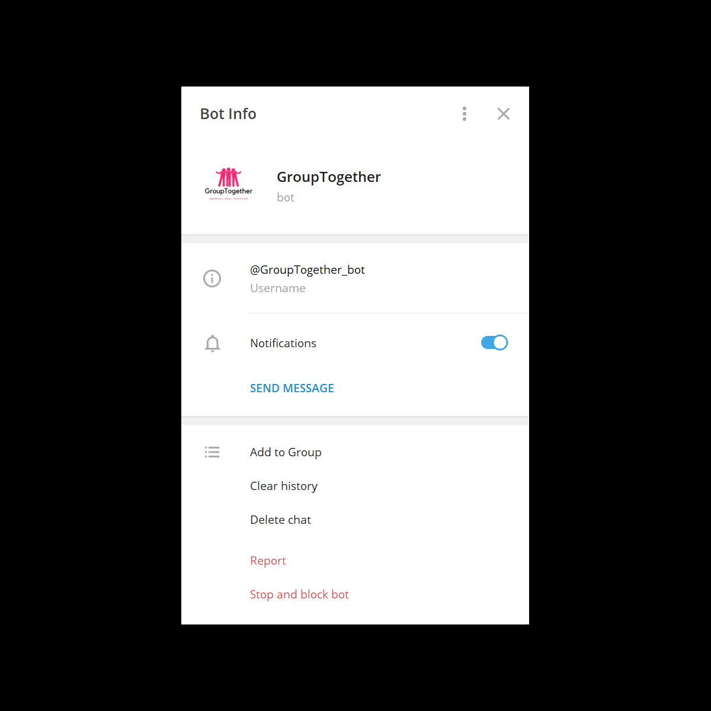

  

# GroupTogether by Team PieTen🥧
* DARIEN TAN SHI FENG (darien.tan.2020@scis.smu.edu.sg) 
  It was an eye opener to pick up on the usage of Telegram Bot API which includes functions of sending messages, replying messages, making buttons, etc. It was worthwhile, having a crash course of learning the API in a day.
* HAZEL MA RUIQI (hazelma.2020@scis.smu.edu.sg) 
  It was my first time developing Telegram Bots using Python and I definitely learnt a lot!
* TAN TING CHER BENJAMIN (benjamintan.2020@scis.smu.edu.sg) 
  Worked on the functions for the backend. It was my first time working on a telegram bot and learning about python OOP, was a very good and fufilling experience, as we were able to develop the bot within a short amount of time.
* STEPHEN PANG QING YANG (stephenpang.2019@scis.smu.edu.sg) 
  I worked mostly on the backend using Python Flask and integrating it with Telegram Bot API. As I have experimented creating telegram bots in the past, it was great experience for me to put what I have learnt to use during this hackathon. I assisted implementing some functionalities, such as the chat feature.
# Project Overview
Our group, PieTenRoll has decided to work on a telegram bot project called GroupTogether, which aims to allow university students to find groupmates for their modules. The inspiration for this project stems from student bidding alone or students not having enough people to form a group. In this bot, we hope to lower the difficulty in finding group members and finding groups that students are able to join. With this mission in mind, we hope that through our bot these pain points are addressed and students are able to seamlessly find teams for their modules.
# What it does
**GroupTogether** is targeting two groups of users namely students who are **looking for a group** and students **looking for groupmates**. Upon starting the bot, the user will be prompted for their name if they are new to the bot. Next, users will choose the option of either finding a group or groupmates. They will then be asked to provide relevant information such as school, module code, section, etc before the bot performs the search. If a match is found, the user would be notified and would be given an option to start a conversation with the other party. During the conversation, users can choose to either accept or reject. If  'reject' is chosen, the conversation ends. Users cannot engage in multiple conversations simultaneously and must choose to accept or reject if they want to move on to the next conversation. 
# Project Demo

# References
# Telegram Handle
[@GroupTogether_bot](https://t.me/GroupTogether_bot)